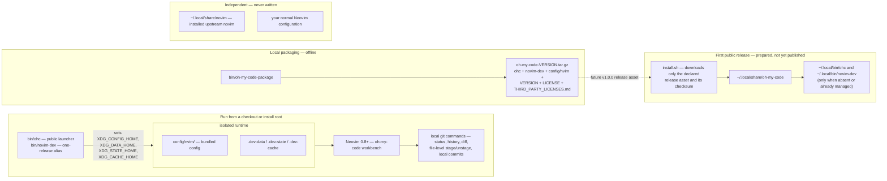

<h1 align="center">oh-my-code</h1>

<p align="center">
  <strong>A terminal-first code workbench.</strong><br>
  Browse a project, read and edit code, and inspect local Git changes through a
  VS&nbsp;Code-like multi-pane interface — without leaving the terminal and
  without learning Vim modes.
</p>

<p align="center">
  
</p>

> **Target audience**: terminal-first developers who want a friendly editor and
> a VS&nbsp;Code-like workbench flow without learning Vim.

## Contents

- [What is oh-my-code?](#what-is-oh-my-code)
- [Requirements](#requirements)
- [Installation](#installation)
- [First launch](#first-launch)
- [The workbench](#the-workbench)
  - [Files and Preview](#files-and-preview)
  - [Source Control](#source-control)
- [Settings and themes](#settings-and-themes)
- [Editing](#editing)
- [Shortcuts](#shortcuts)
- [Architecture](#architecture)
- [Compatibility alias](#compatibility-alias)
- [Privacy and boundaries](#privacy-and-boundaries)
- [Credits and acknowledgments](#credits-and-acknowledgments)
- [License](#license)

## What is oh-my-code?

`oh-my-code` is a terminal code workbench launched by a single command, `ohc`:

- **Files view** — a lazy project tree on the left and a source preview on the
  right. The tree lists the project root at launch and expands one folder level
  at a time on double-click; expansion state lasts for the session only.
- **Source Control view** — the current changes and status, the full
  current-branch history graph, and a side-by-side old/new comparison of the
  selected file, refreshed whenever the view is entered.
- **Settings panel** — six built-in themes, a dot-folder visibility toggle, and
  an embedded key-help section that always matches the real mappings.
- **Friendly editing** — just type to edit, standard Ctrl/Cmd shortcuts, mouse
  selection and dragging, and safe quit with save confirmation.

It is a Bash launcher plus a bundled Neovim configuration, not a fork of
Neovim. The only bundled plugin is `gitsigns.nvim`, shipped inside the config
tree; there is no plugin manager and no third-party plugin requirement.

## Requirements

- A terminal and a POSIX shell (the launcher is a Bash script).
- **Neovim 0.8.0 or newer, already installed.** Neither the launcher nor the
  installer installs Neovim, uses a package manager for it, or uses `sudo`.
- A Git executable for the Source Control view (local Git only).

Normal `ohc` launch is network-free: there is no hosted service, account,
credential flow, or required download.

## Installation

### No hosted release yet

The first public release is planned as `v1.0.0`, delivered through a GitHub
Release plus a networked installer. **That release has not been published
yet**, so there is no hosted download, package-manager formula, or update
channel today.

### Run from this checkout

The checkout runs directly through its public launcher:

```bash
./bin/ohc
```

### Package and validate locally

This repository provides an offline, deterministic packaging helper for local
validation. It builds an allowlisted archive — `bin/ohc`, the one-release
`bin/novim-dev` alias, the complete `config/nvim/` tree, `VERSION`, `LICENSE`,
and `THIRD_PARTY_LICENSES.md` — and can extract it into a new, explicitly named
directory. It performs no network or Git actions and never creates command
links:

```bash
PACKAGE_TMP="$(mktemp -d "${TMPDIR:-/tmp}/oh-my-code-package.XXXXXX")"
ARCHIVE="$PACKAGE_TMP/oh-my-code-$(cat VERSION).tar.gz"

./bin/oh-my-code-package package "$ARCHIVE"
./bin/oh-my-code-package install "$ARCHIVE" "$PACKAGE_TMP/install"
"$PACKAGE_TMP/install/bin/ohc" --version
```

Package contents, verification, and removal boundaries are documented in the
[local distribution guide](docs/LOCAL_DISTRIBUTION.md).

### Public installer (prepared, not yet published)

`install.sh` (also served as `docs/install` for `curl | bash`) is prepared for
the future release. It will download only the declared `v1.0.0` release asset
and its checksum, verify both, validate the archive fail-closed, install only
below `~/.local/share/oh-my-code`, and create `~/.local/bin/ohc` plus the
one-release `~/.local/bin/novim-dev` compatibility link only when absent or
already pointing into the managed root. Until the release is published, it has
no asset to download. When installation exists, there is no in-place update:
to reinstall, remove the install root explicitly first.

## First launch

Start `ohc` inside any project directory:

```bash
cd /path/to/your/project
ohc          # or ./bin/ohc from this checkout
```

On an interactive TTY launch, a bounded (approximately one second) ANSI splash
identifies oh-my-code before the workbench opens. The splash performs no
network call, credential flow, plugin load, or background process, and it is
skipped entirely for:

- `--no-animation` (consumed by the launcher, never forwarded to Neovim),
- `OHC_NO_ANIMATION=1`,
- `--help` and `--version`,
- headless, piped, and test launches.

The launcher sets `XDG_CONFIG_HOME`, `XDG_DATA_HOME`, `XDG_STATE_HOME`, and
`XDG_CACHE_HOME` to isolated locations below its own root, so your normal
Neovim configuration and the installed upstream `novim` release are never
loaded or modified.

## The workbench

### Files and Preview

- The project browser starts with the immediate entries of the project root
  only — no recursive startup scan — so launching in a large directory stays
  responsive.
- Double-click a folder to expand one level at a time; double-click again to
  collapse. Expansion state lives in workbench memory for the current session.
- Dot-prefixed files and folders are hidden by default (toggle in Settings).
- `Space` previews the selected item read-only in the right pane; `Enter`, `e`,
  or `o` opens a regular file as an editable buffer in that pane.
- Every visible pane boundary is draggable with the mouse and clamped to
  sensible minimum widths.

### Source Control

Press `2` (or `d`/`g`) to open the Source Control (Git Diff) view:

- **Changes list** (top left) — current changes and status, refreshed whenever
  the view is entered; `r` refreshes manually at any time.
- **History graph** (bottom left) — the full reachable current-branch graph,
  including merge nodes. History is strictly read-only; nothing is ever checked
  out.
- **Side-by-side comparison** — old content on the left, new content on the
  right, with red removed lines and green added lines. The default baseline is
  the working tree versus `HEAD`, including untracked files. `H`, `O`, `N`, and
  `D` select and reset comparison endpoints.
- **Local Git writes only** — `a` stages the selected change at file level, `u`
  unstages, and `c` commits staged changes with a transient user-entered
  message. There is no push, pull, fetch, checkout, discard, amend, remote
  synchronization, or partial-line staging.

## Settings and themes

Press `s` to open Settings:

- Six application-owned built-in themes: **Tokyo Night** (default), Nord,
  Gruvbox Dark, Catppuccin Mocha, One Dark, and Solarized Light.
- A dot-folder visibility toggle.
- An embedded key-help section rendered from the canonical keymap table, so it
  always matches the actual mappings.
- `Esc` or `q` closes immediately and restores workbench focus; a top-right
  mouse affordance also closes the panel.

Settings persist locally between launches in the isolated state directory —
theme, dot-folder visibility, and per-view pane geometry.

## Editing

- Just type to edit — no modes to learn. Ctrl/Cmd save, undo, redo, copy,
  paste, and select-all work as expected, and mouse selection, dragging, and
  Ctrl+click (open externally) are supported.
- A mouse-completed selection in an editable file buffer is copied automatically
  to the local system clipboard. Read-only Preview and Diff panes do not
  auto-copy.
- `Esc` returns directly to the same file's Preview from every editor mode. If
  the buffer has unsaved changes, you are asked first; confirming keeps the
  in-memory buffer so nothing is silently lost.
- The bottom statusline explains the relevant shortcuts for the current
  context.
- Quitting with unsaved changes prompts to save first.

## Shortcuts

### Workbench

| Key | Action |
|-----|--------|
| `j` / `k` or `↑` / `↓` | Move selection |
| Left click | Select item / switch tabs |
| Double-click | Expand folder / open file / toggle stage |
| `Enter` / `e` / `o` | Open regular file / select |
| `Space` | Preview selected item |
| `1` / `b` / `f` | Project Files view |
| `2` / `d` / `g` | Source Control view (Git Diff vs HEAD) |
| `H` | Focus history list (Source Control) |
| `O` / `N` | Set compare endpoint (old / new) |
| `D` | Reset compare (HEAD vs Worktree) |
| `a` | Stage selected change (file level) |
| `u` | Unstage selected change (file level) |
| `c` | Commit staged changes (Enter / Esc input) |
| `Tab` / `Shift-Tab` | Switch left/right pane |
| Drag boundary | Resize panes (drag divider) |
| `r` or `Ctrl-R` | Refresh files and Git status |
| `s` or `S` | Open settings |
| `?` | Show workbench help |
| `:` | Command line |
| `q` or `Esc Esc` | Quit the workbench |

### Settings

| Key | Action |
|-----|--------|
| `j` / `k` or `↑` / `↓` | Move control selection |
| `Space` / `Enter` | Activate selected control |
| `h` / `←` / `[` | Previous theme (Theme selected) |
| `l` / `→` / `]` | Next theme (Theme selected) |
| `t` | Toggle dot-folder visibility |
| `q` / `Esc` | Close settings (Esc closes immediately) |

### Basic editing

| Key | Action |
|-----|--------|
| Ctrl+S (Cmd+S) | Save |
| Ctrl+Z (Cmd+Z) | Undo |
| Ctrl+Shift+Z (Cmd+Shift+Z) | Redo |
| Ctrl+A (Cmd+A) | Select all |
| Ctrl+C (Cmd+C) | Copy (keeps selection) |
| Ctrl+V (Cmd+V) | Paste |
| Shift+Arrow | Select text |
| Ctrl+G (Cmd+G) | Git status |
| Ctrl+L (Cmd+L) | Git log |
| Ctrl+D (Cmd+D) | Git diff workbench |
| `Esc Esc` | Quit (with save confirmation) |
| `?` | Help |

## Architecture

oh-my-code keeps a hard boundary between the product you launch, the state it
writes, the way it is distributed, and the upstream `novim` installation that
may already exist on your machine:



- The launchers resolve their own root dynamically and run Neovim with the
  bundled configuration and isolated data, state, and cache directories, so
  settings persisted through either command name remain valid.
- The packaging helper stages an allowlisted, deterministic archive and never
  includes Git metadata, private runtime data, links, or `bin/novim`.
- The installer is fail-closed: checksum verification, archive validation, and
  link-collision refusal leave existing files untouched on any failure.
- The installed upstream `novim` command, its `~/.local/share/novim` release,
  and your normal Neovim configuration are outside every write path.

More detail: [architecture overview](docs/architecture.md) and the
[local distribution guide](docs/LOCAL_DISTRIBUTION.md).

## Compatibility alias

`novim-dev` remains available as an explicitly labeled **one-release
compatibility alias** for `ohc`. Both commands share the same bundled
configuration and isolated runtime boundary, and both skip the splash under the
same bypass rules. The alias does not replace, and is not related to, the
separately installed upstream `novim` command — which this project never
overwrites or updates.

## Privacy and boundaries

- Normal launch and all workbench features are network-free.
- Git information is obtained through local Git subprocesses; no source,
  credentials, or raw private data leave the machine by default.
- The installer (once a release exists) downloads only the declared release
  asset and never runs any upstream updater.

## Credits and acknowledgments

oh-my-code is built on top of amazing open source projects and is derived from
the upstream [novim](https://github.com/link2004/novim) project (baseline tag
`v0.1.7`):

### Core

- **[Neovim](https://neovim.io/)** — The hyperextensible Vim-based text editor
  License: Apache 2.0 / Vim License
  Copyright © Neovim contributors

### Plugins

- **[gitsigns.nvim](https://github.com/lewis6991/gitsigns.nvim)** — Git integration for buffers
  License: MIT
  Copyright © 2020 Lewis Russell

### Color Scheme

- **[Tokyo Night](https://github.com/tokyo-night/tokyo-night-vscode-theme)** — Color palette inspiration
  License: MIT
  Copyright © enkia

### Logo

- **[oh-my-logo](https://github.com/shinshin86/oh-my-logo)** — ASCII logo inspiration
  License: MIT / CC0-1.0

### Similar Projects

- **[novim-mode](https://github.com/tombh/novim-mode)** — A Vim plugin with similar goals (make Vim behave like a normal editor). novim is a separate project with a different approach (standalone wrapper vs plugin).

Upstream technical background: [How it works](docs/HOW_IT_WORKS.md).

## License

MIT — see [LICENSE](LICENSE).

See [THIRD_PARTY_LICENSES.md](THIRD_PARTY_LICENSES.md) for full license texts
of dependencies.
